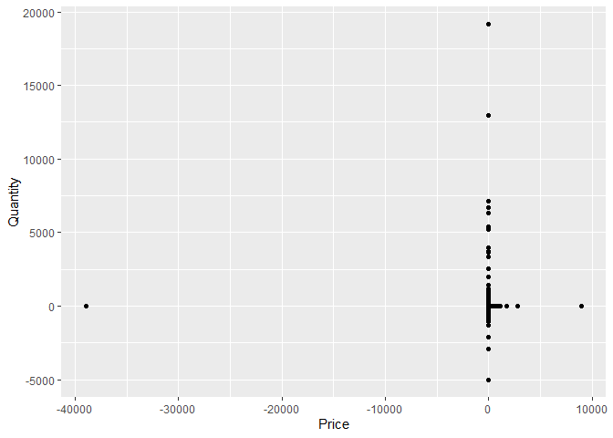
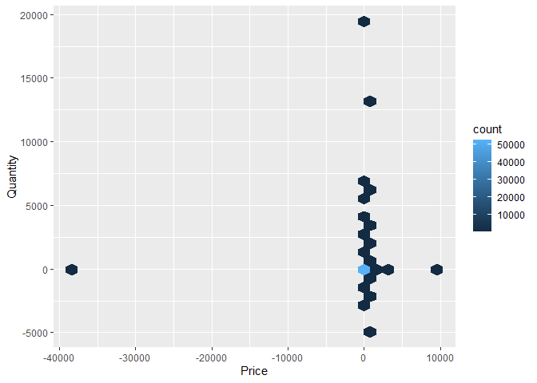
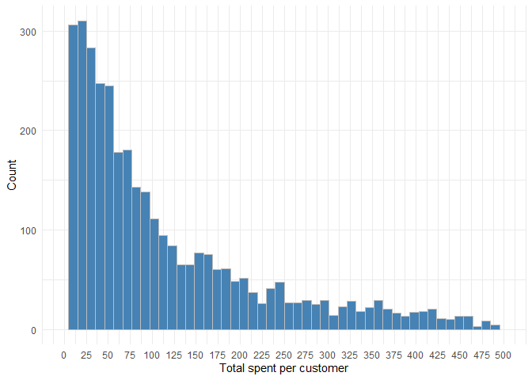
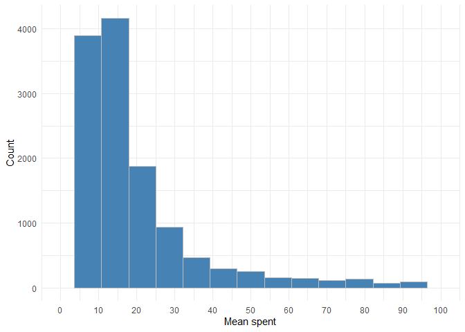
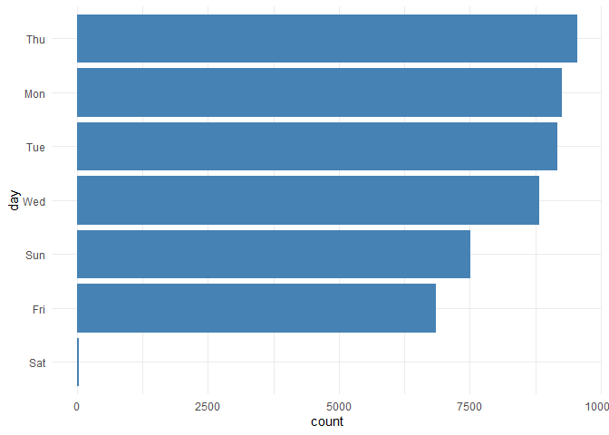
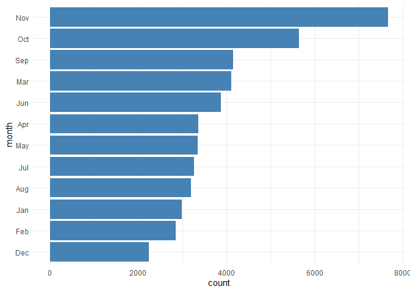

Taqtile Challenge
================
Ricardo Mühlstedt
2023-05-19

## Preparação

Algumas descrições, identificações de mercadoria e cliente estão
faltando, assim como existem dados inseridos manualmente. Há também
valores negativos, que devem ser observados com cuidado.

``` r
raw_data %>%
  filter(Quantity <= 0) %>%
  count(name = "count") %>%
  knitr::kable()
```

| count |
|------:|
|  1195 |

``` r
raw_data %>%
  filter(Price <= 0) %>%
  count(name = "count") %>%
  knitr::kable()
```

| count |
|------:|
|   360 |

Existem também notas físcais canceladas, indentificadas por um “C” no
começo de cada numeração.

| count |
|------:|
|   993 |

Na identificação de cada produto, é possível notar uma quantidade de
dados que não se encaixam no padrão. Esses dados foram inseridos
manualmente, possivelmente para ajustar valores ou erro humano. A falta
de identificação de consumidor está ligado a esse mesmo tipo de dado.

| count |
|------:|
|   285 |

É possível encontrar o valor máximo de um produto cadastrado, filtrando
os dados pelo código de estoque, facilitando a identificação de
*outliers*

| Description                  | Price |
|:-----------------------------|------:|
| VINTAGE BLUE KITCHEN CABINET |   295 |
| VINTAGE BLUE KITCHEN CABINET |   295 |
| VINTAGE RED KITCHEN CABINET  |   295 |
| VINTAGE BLUE KITCHEN CABINET |   295 |
| VINTAGE BLUE KITCHEN CABINET |   295 |

## Perguntas

### Quantos dados nulos temos em cada coluna?

| invoice | stock_code | description | quantity | invoice_date | price | customer_id | country |
|--------:|-----------:|------------:|---------:|-------------:|------:|------------:|--------:|
|       0 |          0 |         289 |        0 |            0 |     0 |       10697 |       0 |

### Quais são os tipos das variáveis de cada coluna?

| Invoice   | StockCode | Description | Quantity | InvoiceDate | Price   | Customer ID | Country   |
|:----------|:----------|:------------|:---------|:------------|:--------|:------------|:----------|
| character | character | character   | numeric  | POSIXct     | numeric | numeric     | character |
| character | character | character   | numeric  | POSIXt      | numeric | numeric     | character |

### Qual o faturamento total do ano de 2010?

O faturamento de uma empresa pode ser separado em duas categorias, bruto
e líquido. Considerando que temos diversas observações negativas com
descrições como : *“bad debt”* e *“lost”*, considero que existem dados
de compras e custos de operação na base de dados.

Foi utilizado para essa análise o faturamento bruto, ou seja, removendo
todos os dados de vendas que foram canceladas ou valores negativos
(representando custos de operação).

| faturamento_bruto |
|:------------------|
| 927958.96         |

### Quantos produtos distintos esta loja vendeu?

| count |
|------:|
|  3761 |

### Qual foi o produto mais vendido do dia 15 de junho de 2010?

| Description                    | count |
|:-------------------------------|------:|
| 72 SWEETHEART FAIRY CAKE CASES |   360 |
| PACK OF 60 SPACEBOY CAKE CASES |   360 |

### Qual o top 10 de produtos de maior volume de venda nos três últimos meses de 2010?

| Description                        | count |
|:-----------------------------------|------:|
| BROCADE RING PURSE                 |  6568 |
| PAPER CHAIN KIT 50’S CHRISTMAS     |  2105 |
| PACK OF 72 RETROSPOT CAKE CASES    |  2103 |
| WHITE HANGING HEART T-LIGHT HOLDER |  1615 |
| ASSORTED COLOUR BIRD ORNAMENT      |  1336 |
| JUMBO BAG RED RETROSPOT            |  1274 |
| PARTY CONE CHRISTMAS DECORATION    |  1108 |
| WORLD WAR 2 GLIDERS ASSTD DESIGNS  |  1019 |
| FOLKART ZINC HEART CHRISTMAS DEC   |   989 |
| VICTORIAN GLASS HANGING T-LIGHT    |   941 |

### Quando ocorreu o maior pico diário de faturamento desta loja?

Novamente, apenas o faturamento bruto é considerado.

| InvoiceDate |    count |
|:------------|---------:|
| 2010-11-15  | 18712.54 |

### Qual o preço médio dos produtos que contém a palavra “METAL”?

| mean_price |
|:-----------|
| 3.618426   |

### Quantos usuários compraram canecas em 2010?

Foi considerado traduções da palavra “Caneca”, como *“Stein”* ou
*“Tankard”*, porém apenas *“Mug”* retornou resultados.

| count |
|------:|
|   185 |

### Existe alguma compra fora da normalidade nesta base?

Existem diversas observações fora da normalidade. Valores fora do comum,
descrições fora do padrão, inseridos manualmente e codificados
incorretamente.

<!-- -->

A maior parte dos dados estão localizados no centro do gráfico, tornando
as outras observações *“Outliers”*. Porém, existem dados que não fazem
parte do grupo geral, mas não apresentam motivo para serem
desqualificados como uma venda valida.

<!-- -->

Muitas vezes as quantidades são exorbitantes, mas o valor total da venda
não foge da realidade, mesmo sendo incomum.

### Qual a distribuição do valor total gasto por cliente?

<!-- -->

### Qual a distribuição do valor médio gasto por Invoice (Nota Fiscal)?

<!-- -->

### Existe algum horário e dia da semana preferencial para a venda? Se sim, quais?

<!-- -->

Considerando que, um horário específico de compra não é de grande valor
em uma ánalise mais abrangente. Foi-se utilizado os três períodos de um
dia: *Manhã*, *tarde* e *noite*.

*Manhã* = 00:00 até 11:59

*Tarde* = 12:00 até 17:59

*Noite* = 18:00 até 23:59

| morning | afternoon | night | count |
|:--------|:----------|:------|------:|
| FALSE   | TRUE      | FALSE | 35987 |
| TRUE    | FALSE     | FALSE | 14976 |
| FALSE   | FALSE     | TRUE  |  1583 |

### Existe algum indício de sazonalidade na venda geral de produtos?

Foram removidos todos os dados do ano de 2009, pois existem apenas dados
referentes ao mês de dezembro, um dos meses com maior número de vendas,
que causaria uma inflação na distribuição mensal.
<!-- -->

### Que produtos você colocaria em anúncios promocionais para o Natal de 2011?

Os produtos que são anunciados em preços promocionais dependem do
objetivo da empresa.

Caso o objetivo seja acabar com estoque de produtos com baixa demanda,
que não foram vendidos natal passado e restam sobras. O natal
justificaria uma promoção sem criar uma falsa expectativa dado a redução
dos preços, porém a informação de quantidade de produtos disponíveis não
nos está disponível, apenas a quantidade de vendas efetuadas.

Para aumentar as vendas em curto prazo e possivelmente atrairá novos
clientes, pode ser oferecido os produtos de alta demanda na época de
natal. Se a demanda continuar igual, haverá uma redução de lucros
totais, mas a possibilidade de atração de novos clientes ou até mesmo a
compra em maior quantidade, ou atração para outros produtos dado a
redução de gasto total de cada cliente. Não há informações sobre o
mercado externo e competição, o que dificulta saber o motivo da alta
demanda pelos produtos, que podem ser dados a um baixo custo relativo a
outros comércios.

A estratégia usada nessa análise, é incorporar às duas opções dadas
acima. Em meio a uma maior quantidade de produtos de baixa demanda,
incluir produtos requisitados para atrair interesse, e permitir o
cliente a reconsiderar os itens antes não adquiridos.

| Description                         | count |       pct |
|:------------------------------------|------:|----------:|
| PAPER CHAIN KIT 50’S CHRISTMAS      |  2356 | 0.9078158 |
| PACK OF 72 RETROSPOT CAKE CASES     |  2127 | 0.8195774 |
| ASSORTED COLOUR BIRD ORNAMENT       |  2069 | 0.7972288 |
| POPART COL BALLPOINT PEN ASST       |  2000 | 0.7706416 |
| JUMBO BAG RED RETROSPOT             |  1740 | 0.6704582 |
| DISCO BALL CHRISTMAS DECORATION     |  1552 | 0.5980179 |
| SET 4 NURSERY DES ROUND BOXES       |  1440 | 0.5548620 |
| 12 MINI TOADSTOOL PEGS              |     1 | 0.0005192 |
| 4 PURPLE FLOCK DINNER CANDLES       |     1 | 0.0005192 |
| 4 SKY BLUE DINNER CANDLES           |     1 | 0.0005192 |
| 5 STRAND GLASS NECKLACE AMETHYST    |     1 | 0.0005192 |
| 50CM METAL STRING WITH 7 CLIPS      |     1 | 0.0005192 |
| 6 SEGMENT COLOURED SNACK BOWL       |     1 | 0.0005192 |
| ACRYLIC JEWEL ICICLE, CLEAR         |     1 | 0.0005192 |
| AMBER 3 BEAD DROP EARRINGS          |     1 | 0.0005192 |
| AMBER VINTAGE EARRINGS              |     1 | 0.0005192 |
| AMETHYST DROP EARRINGS W LONG BEADS |     1 | 0.0005192 |
| AMETHYST GLASS/SHELL/PEARL NECKLACE |     1 | 0.0005192 |
| ANT COPPER PINK BOUDICCA BRACELET   |     1 | 0.0005192 |
| ANTIQUE CREAM CUTLERY CUPBOARD      |     1 | 0.0005192 |
| ANTIQUE OPAL WHITE FLOWER EARRINGS  |     1 | 0.0005192 |
| ASS FLORAL PRINT SPIRIT LEVEL       |     1 | 0.0005192 |
| ASS FLORAL PRINT TAPE MEASURE       |     1 | 0.0005192 |
| ASSORTED COLOUR JUMBO PEN           |     1 | 0.0005192 |
| ASSORTED EASTER GIFT TAGS           |     1 | 0.0005192 |
| ASSORTED FRAGRANCE BATH CONFETTI    |     1 | 0.0005192 |
| ASSORTED ICE CREAM FRIDGE MAGNETS   |     1 | 0.0005192 |
| ASSORTED SHAPES PHOTO CLIP SILVER   |     1 | 0.0005192 |
| ASSTD MULTICOLOUR CIRCLES MUG       |     1 | 0.0005192 |
| BALLERINA HEART DECORATION.         |     1 | 0.0005192 |
| BAROQUE BUTTERFLY EARRINGS GREEN    |     1 | 0.0005192 |
| BAROQUE BUTTERFLY EARRINGS RED      |     1 | 0.0005192 |
| BATH DUCK WATERING CAN              |     1 | 0.0005192 |
| BATHROOM SCALES RUBBER DUCKS        |     1 | 0.0005192 |
| BATHROOM SET LOVE HEART DESIGN      |     1 | 0.0005192 |
| BEACH HUT PHOTO FRAME               |     1 | 0.0005192 |
| BEADED CRYSTAL HEART PINK LARGE     |     1 | 0.0005192 |
